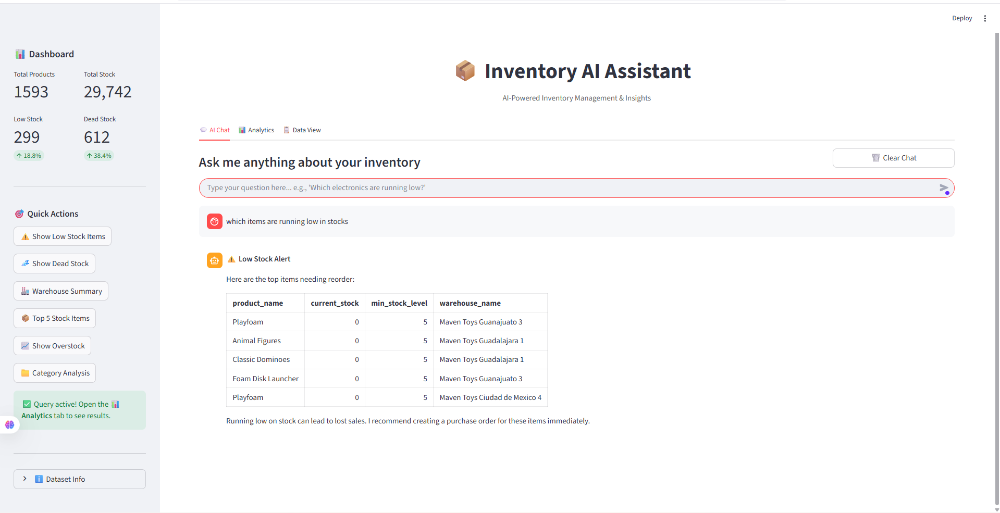
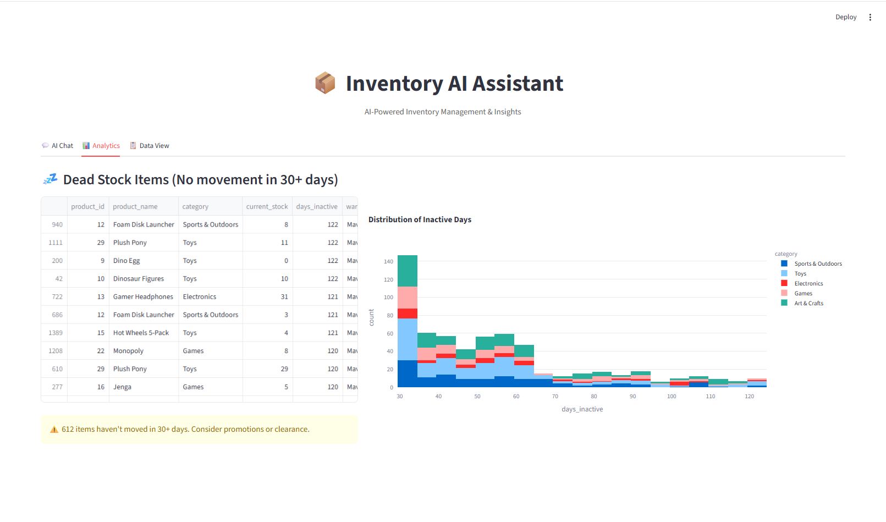
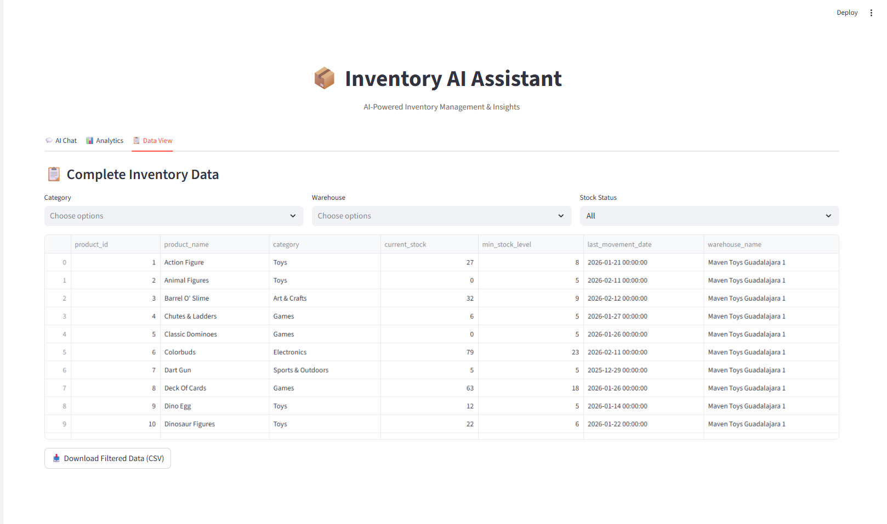
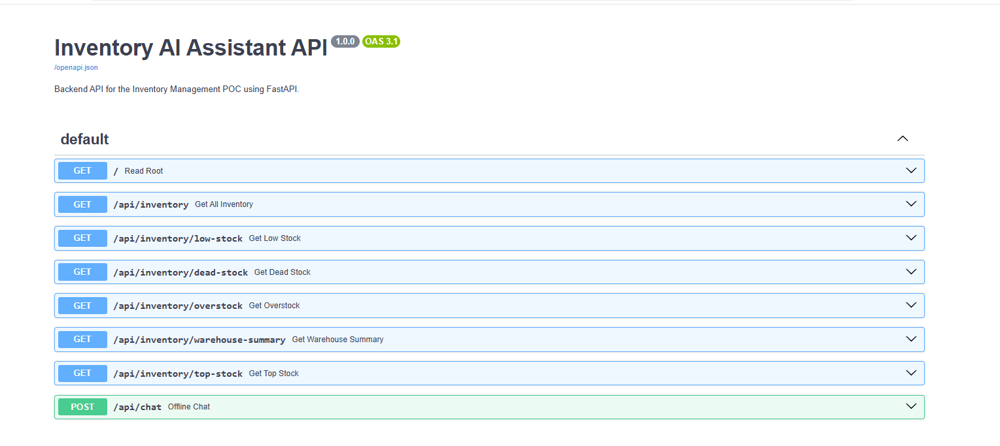

# 📦 AI-Powered Inventory Management Assistant

An innovative **Inventory Management Dashboard & Backend API** designed to operate completely offline using an intelligent rule-based logic engine. Built as a logic validation assignment for a startup POC, focusing on real-world dataset analysis.

---

## 🎯 What The Project Is All About

Modern inventory systems often rely heavily on expensive, rate-limited Cloud AI APIs. This project proves that you can build a highly capable, instantaneous **Inventory Assistant** without relying on third-party Large Language Models (LLMs).

By using **Python, Pandas, FastAPI, and Streamlit**, we created a scalable architecture that parses natural language queries and executes complex analytical rules directly against massive real-world datasets.

**Core Capabilities include:**
- Spotting **Dead Stock** that hasn't moved in 30+ days to free up capital.
- Triggering **Low Stock** and **Out of Stock** alerts to prevent lost sales.
- Analyzing **Warehouse Demographics** and identifying **Overstock** anomalies.
- A fully functional **Offline Chatbot** capable of fuzzy-matching user intent ("Show me the highest stock items", "What is sold out?", "Do we have any new stock?").

---

## 📸 Screenshots


| 💬 Interactive Offline Chatbot | 📊 Visual Analytics Dashboard |
| :---: | :---: |
| ** | ** |

| 📋 Raw Data Management | ⚡ FastAPI Swagger Specs |
| :---: | :---: |
| ** | ** |

---

## � Key Features

### 1️⃣ The Offline Chat Engine
Our natural language engine recognizes dozens of query variations using a powerful keyword routing system:
- **Alerts**: "low", "shortage", "reorder", "minimum", "refill", "buy"
- **Anomalies**: "dead", "inactive", "stuck", "obsolete", "overstock", "surplus"
- **Summaries**: "warehouse", "store", "location", "category", "breakdown"
- **Statistics**: "how many", "count", "metrics", "stats", "recent", "top", "best"
- **Fuzzy Lookups**: Automatically matches precise product names or category groups if general keywords fail.

### 2️⃣ Visual Analytics Dashboard (Plotly)
Instantly generate visual insights with a click of a button!
- Interactive Pie Charts mapping category distributions.
- Horizontal Bar Charts identifying geographical shortages.
- Histograms plotting inactive days across your product portfolio.

### 3️⃣ Real-World Data Processing
Designed to work with actual enterprise data, including out-of-the-box support for the massive **Maven Toys Kaggle Dataset** (1,500+ unique inventory records mapping to 800k+ sales!).

### 4️⃣ REST-compliant Backend
Fully separated architecture featuring a high-speed **FastAPI** server that computes inventory logic and serves JSON to any frontend client.

---

## ⚙️ Technical Architecture

- **Backend / API Wrapper**: FastAPI (Python)
- **Frontend / Visualization**: Streamlit, Plotly
- **Data Engine**: Pandas, NumPy
- **Environment Management**: Python-dotenv

```text
┌─────────────────────────────────────────┐
│   Streamlit UI (Dashboard + Chat)       │
└─────────────┬───────────────────────────┘
              │ REST / Logic Invocation
    ┌─────────┴─────────┐
    │                   │
┌───▼────┐      ┌───────▼────────┐
│ UI     │      │ FastAPI Server │
│ Engine │      │ (main.py)      │
└───┬────┘      └───────┬────────┘
    │                   │
    └─────────┬─────────┘
              │ Pandas Dataframes
     ┌────────▼─────────┐
     │  Real-World CSV  │
     │ (inventory.csv)  │
     └──────────────────┘
```

---

## 📁 Project Files

| File | Description |
|------|-------------|
| `app.py` | The main **Streamlit frontend** housing the Chat UI, Dashboard, Plotly visualizations, and keyword-parsing rule engine. |
| `main.py` | The **FastAPI backend** server, exposing critical inventory metrics as structured JSON endpoints. |
| `convert_maven_toys.py` | A utility script built to transform the raw Kaggle Maven Toys database into our project's required schema. |
| `inventory.csv` | The primary data source storing product IDs, stock levels, warehouse names, and movement dates. |
| `requirements.txt` | Python dependency lockfile. |
| `.env.example` | Template indicating where to place environment variables if connecting to external DBs or turning Cloud AI features back on. |

---

## 🚀 How To Run Locally

### Prerequisites
- Python 3.10 or higher
- Git

### Installation
**1. Clone the repository and install dependencies**
```bash
git clone <your-repo-url>
cd immersow_poc
pip install -r requirements.txt
```

**2. Ensure you have your dataset ready**
*(Either provide your own `inventory.csv` or run `python convert_maven_toys.py` after downloading the Kaggle Maven Toys dataset into the folder).*

### Execution
**1. Start the Backend API (Terminal 1)**
```bash
uvicorn main:app --reload --port 8000
```
*Access interactive API documentation at: http://localhost:8000/docs*

**2. Start the Frontend Application (Terminal 2)**
```bash
streamlit run app.py
```
*Access the Visual Dashboard and AI Chat at: http://localhost:8501*

---

## 👨‍💻 Created By

This POC was collaboratively engineered and developed by:
* **Ojas Panse**
* **Rohit Dahiphale**
* **Atharva Yeole**
